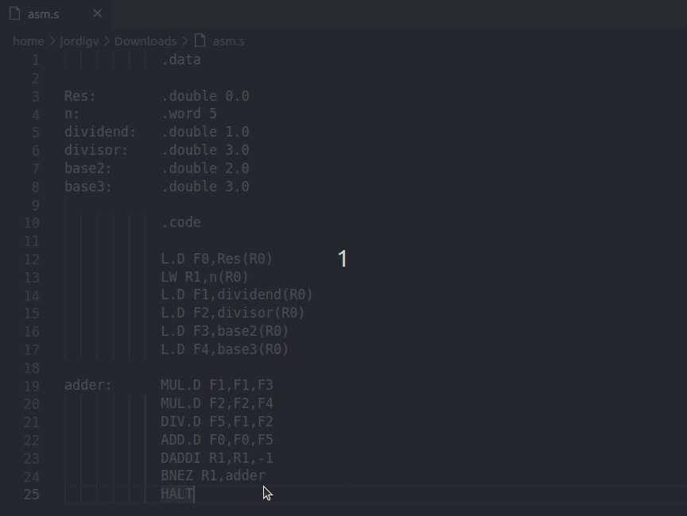

# column-maker README

Make a column adding spaces to all selected lines since a specific width.

> 💡 Revertible using the command *Trim Trailing Whitespace*

## Preview

## Extension Commands

* `column-maker: Make Column`: make a column from the selection in two possible ways: 
  
  *  **Fixed width**: specifying the column width. If there are larger lines you can:
  
       * Omit them

       * Split them with line breaks
  
  *  **Margin**: specifying the amount of characters from the largest line.